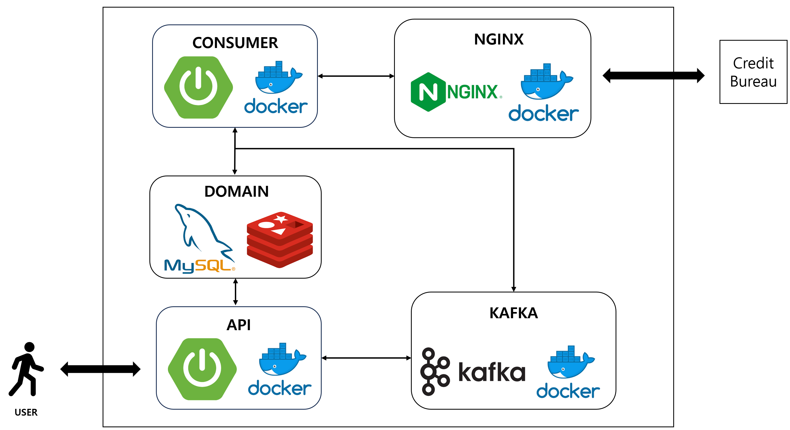
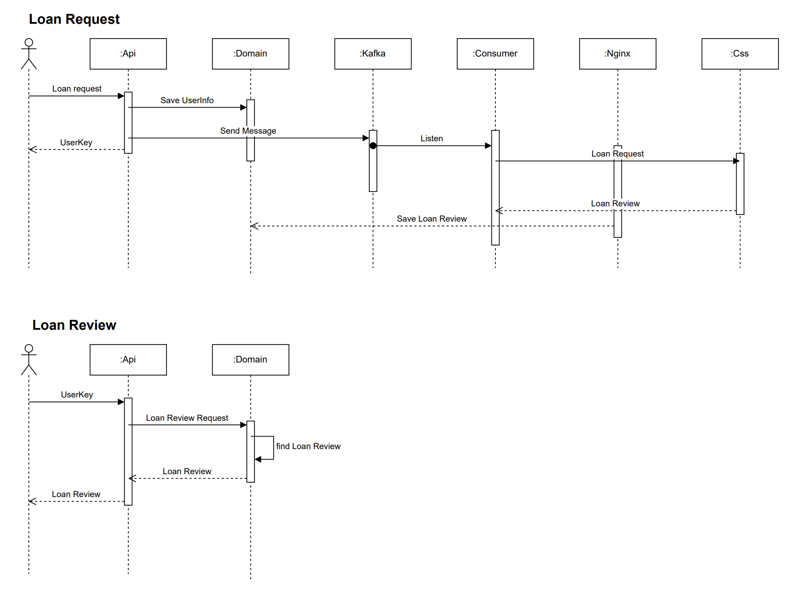
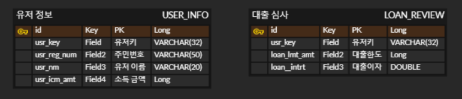

# 대출심사 서비스 만들기

은행 업무중 대출 심사를 진행하는 서비스 프로젝트

## 프로젝트 구성

## Sequence Diagram

- 대출 요청
  - 사용자로부터 대출요청을 받음
  - UUID를 사용하여 UserKey를 생성한 후에 DB에 저장
  - Kafka에 message send
  - Listen한 Consumer에서 Proxy인 Nginx로 요청 전송
  - Nginx에서 CB사 역할을 하는 Css에 요청 전송
  - CB사에서 받은 정보를 DB에 저장
  

- 대출 확인
  - 사용자로부터 대출확인 요청을 UserKey로 받음
  - Redis Cache를 사용하여 캐시 추가 및 캐시 데이터 반환

## ERD

## 개선사항
- RestTemplate 대신 WebClient로 구현
- 외부와 통신하는 부분을 모듈화
- 도커 네트워크의 분리
- 실제 클라우드에 배포를 해보기
- 예외 처리 및 로그 적용하기
- 테스트 코드 전체적으로 구현해보기

### Tech Stack

 
   
  
   
  
  
  
  
  
  

